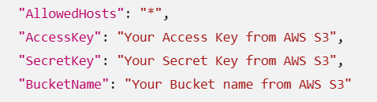

# document-management-system-with-react-docx-editor
A document management system built with React, Syncfusion DOCX Editor, and a Dockerized ASP.NET Core Web API. Supports document editing, version history, document comparison, save, downloads, and AWS S3 storage integration.

# Version History Sample

A Word-style document editor with versioning. Documents are stored in **AWS S3**; each save creates a new version (`v1.docx`, `v2.docx`, ...) under a per-document prefix, so users can browse history and compare any version against its predecessor.

---

## How it works

1. The **React client** ([`Client-Side`](Client-Side)) shows a grid of all documents that exist in the S3 bucket.
2. Clicking **View** (eye) opens the latest version read-only. Clicking **Edit** (pencil) opens it in Ribbon mode and the **Save** button uploads a new version to S3 as `v{n}.docx`. Clicking **History** (thumbnail) opens a dialog with a tree of all versions; selecting any version diffs it against its predecessor.
3. The **API server** ([`Server-Side`](Server-Side)) runs inside a Docker container and handles load, save, list, compare, and download against the S3 bucket. There is no local file storage — everything lives in S3.

---

## Prerequisites

- **Docker Desktop** installed and **running** (the Docker daemon must be up before you build — start it from the system tray / Docker Desktop first).
- An **AWS S3 bucket** with read/write access.

---

## Setup

### 1. Configure AWS credentials

Open [`Server-Side/src/ej2-documenteditor-server/appsettings.json`](Server-Side/src/ej2-documenteditor-server/appsettings.json) and fill in your keys:



```json
"AccessKey": "Your Access Key from AWS S3",
"SecretKey": "Your Secret Key from AWS S3",
"BucketName": "Your Bucket name from AWS S3"
"BucketRegion": "us-east-1"
```

### 2. Build the image

From inside the `Server-Side` folder (where the `Dockerfile` lives), and after starting Docker:

```console
docker buildx build --platform linux/amd64 -t docxserver:latest --output type=docker .
```

### 3. Find the new image id

```console
docker images
```

Note the `IMAGE ID` of the `docxserver:latest` row (e.g. `6240fdecf515`).

### 4. Run the container

```console
docker run -d -p 6028:80 6240fdecf515
```

This maps container port `80` to host port `6028`. The API is now available at `http://localhost:6028`.

---

## What flows through which endpoint

| Action | Endpoint |
|---|---|
| List documents | `GetAllDocumentsFromS3` |
| Load latest version | `LoadLatestVersionDocumentFromS3` |
| Save (creates new `v{n}.docx`) | `AutoSaveToS3` (Save button in title bar) |
| Show version history tree | `GetVersionDataFromS3` |
| Compare a version with the previous one | `CompareSelectedVersionFromS3` |
| Download a specific version | `DownloadFromS3` |

All endpoints accept `{ fileName }` (or `{ DocumentName }` for compare/download) and read/write directly to the configured S3 bucket.
